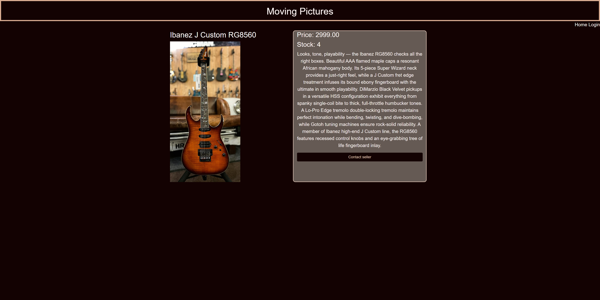
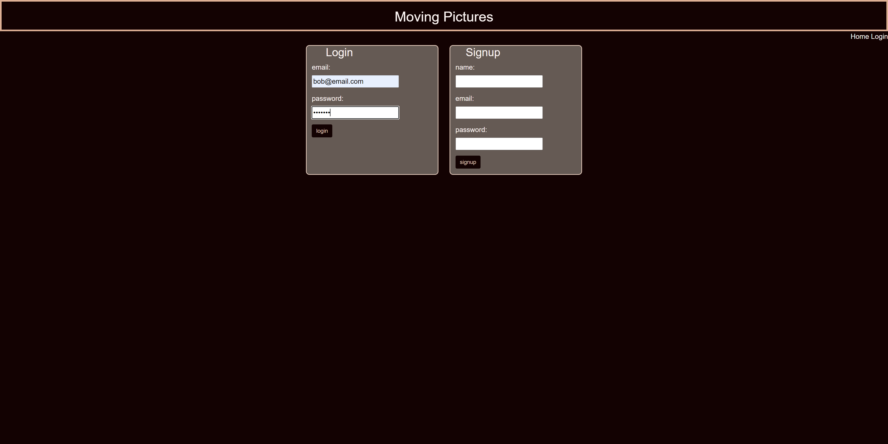
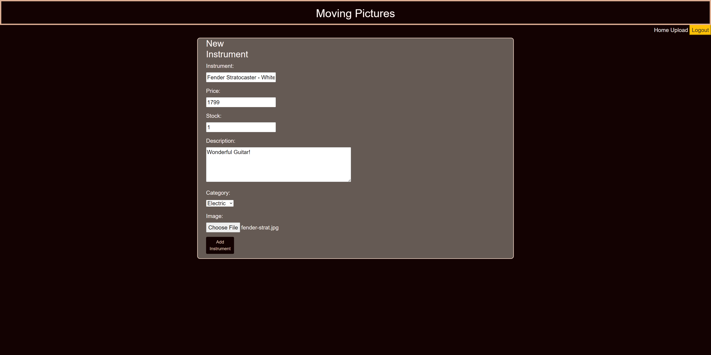
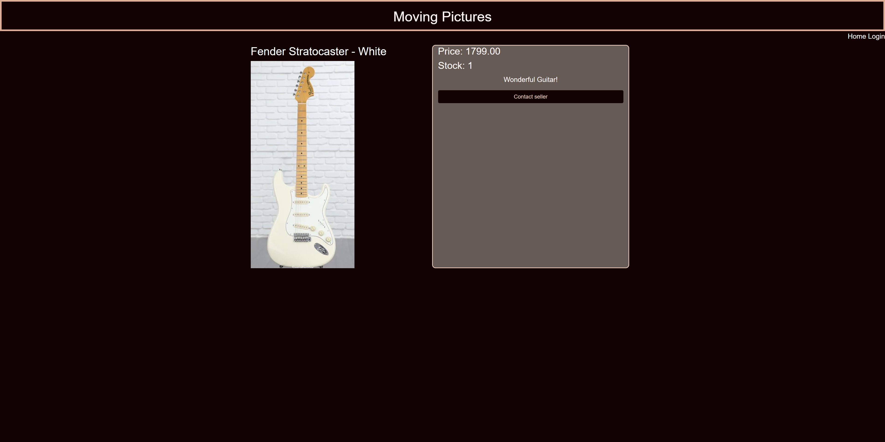

# Moving Pictures
Purchase and Sell gear

## Table of Content
* [Description](#description)
* [Screenshot](#screenshot)
* [Links](#links)
* [Credit](#credit)
* [License](#license)

## Description
For musicians trying to buy new gear, sometime's the hidden fee's can really stack up when purchasing a new instrument through a store such as Reverb. Well with Moving Pictures, you can buy straight from the seller, no hidden fee's attached. With this app, browse through the user listed instruments, and find the axe that speaks to you. Are you looking for something to shred on? Or are you looking for a nice guitar to play around a campfire? Luckily we have a variety of instruments listed to suit your needs. 

But what if you want to sell an item? Simply just create a profile, and you will have the option to upload your own instrument for sale. You will include the name of the instrument, the price of the instrument, how many you are selling, and then a quick description to let any user read about your instrument. Once you have finished these steps, simply create the post and your instrument will be displayed accordingly. Wether you are trying to fund new gear, or acquire new gear, Moving Pictures has you covered. 

## Screenshot

## Links

Github: https://github.com/palhambra/Moving-Pictures

Website : https://limitless-scrubland-26764.herokuapp.com/

## Credit
 - Frank Castaneda : https://github.com/fcastaneda88
 - Paolo Alhambra : https://github.com/palhambra
 - Wes Harrison : https://github.com/GrindBoiWes

## License 

No license was used for this repo.